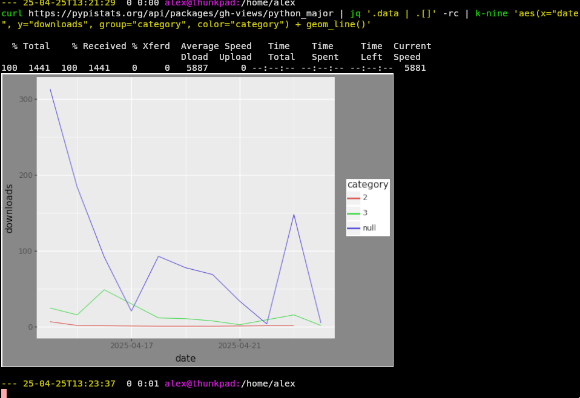

# kitty plotnine (k-nine)
**@readwithai** - [X](https://x.com/readwithai) - [blog](https://readwithai.substack.com/) - [machine-aided reading](https://www.reddit.com/r/machineAidedReading/)

Plot graphs directly in the terminal with shell one-liners.

Use the [Grammar of Graphics](https://vita.had.co.nz/papers/layered-grammar.pdf) library [plotnine](https://plotnine.org/) from the command-line if your terminal supports kitty's [terminal graphics protocol](https://sw.kovidgoyal.net/kitty/graphics-protocol/).

*Note: This project is not affiliated with kitty or plotnine, but mskes use them*

## Motivation
</img>
You probably don't want to do this. Start up [jupyter](https://jupyter.org/), use `subprocess.check_output` to fetch some data from your process or script and do analysis the normal way in jupyter. It'll keep track of all your history for you, let you rerun commands, write proper python functions, save your output and even make your plots interactive.

But isn't that just so much *effort*; doesn't the browser suck with all the *clicking*; wouldn't you like to have some nice man pages and be able to press <kbd>C-r</kbd>? If you are sufficiently lazy to want to make some more work for yourself, you can use this library to do your plotting directly in the shell with one-line commands.

A number of terminals including [Kitty](https://github.com/kovidgoyal/kitty), [KDE's Konsole](https://konsole.kde.org/) and [WezTerm](https://wezterm.org/
) (and Ghostty which you should not use *) now support high-definition graphics directly in the terminal. This can be used together with plotnine to plot in the terminal. This has some nice properties, you can see the rendered images directly under the commands that generate them within your terminal and scroll back to see earlier images with their associated commands.

## Alternatives and prior work
This tool combines three properties: Being able to plot from the terminal with a "one-liner" ; being able to plot in high resolution in the terminal; being trivial to install and use. In this regard, I believe this tool is quite unique but the components which it comprises of are not.

There are a number of visualisation tools for [kitty](https://sw.kovidgoyal.net/kitty/integrations/#system-and-data-visualisation-tools). The closest to `k-nine` is a wrapper around `gnuplot` which displays output using kitty's internal `icat`. This could easily be adapted to use something cross-terminal like `timg` and timg will fall back to timg based rendering.

There are many *libraries* to produce this sort of output in kitty. I am using
[matplotlib-backend-kitty](https://github.com/jktr/matplotlib-backend-kitty), [kitcat](https://github.com/mil-ad/kitcat) is an alternative for Python. It would be comparatively simple to produce an image of plot in any language and render it with one oftupjhttps://youtu.be/FpSwnzL1lwc?si=HVchEaSnUlilSEvEhttps://youtu.be/FpSwnzL1lwc?si=HVchEaSnUlilSEvEsrpiolikd.ampikort.shrwelp.xertijA1 kitty's image programs such as [icat](https://sw.kovidgoyal.net/kitty/kittens/icat/) or [timg](https://github.com/hzeller/timg).

There are other approaches to rendering graphics within the terminal than the graphics terminal protocol, but these are of a lower resolution. These tend to use characters to represent graphical components. One such example is the [sixel](https://github.com/saitoha/libsixel) library.

There are other tools that can be run from the command-line and plot in another window. [gnuplot](https://jasonmurray.org/posts/2020/basicgnuplot/) can plot from the command-line (rendering in a GUI window ) but the syntax is not terribly succinct nor easy to remember.  [sparklines](https://github.com/deeplook/sparklines) with produce a spark-line, these are very succinct plots that are good at showing the rate of change.

## Attribution
This tool is a thin wrapper around the [plotnine](https://plotnine.org/) and [matplotlib-backend-kitty](https://github.com/jktr/matplotlib-backend-kitty) libraries. Plotnine is turn a reimplementation of [ggplot2](https://github.com/tidyverse/ggplot2) which was influenced by the somewhat philosophical book [A Grammar of Graphics](https://link.springer.com/book/10.1007/0-387-28695-0). The existence of this tool is dependent on the Terminal Graphics Protocol which was pioneered by [kitty](https://github.com/kovidgoyal/kitty), which is in turn an improvement to sixel-based libraries.

## Demo



## Installation
You can install `k-nine` using [pipx](https://github.com/pypa/pipx) with:

```
pipx install kitty-plotnine
```

## Usage 🐶😺😸😹😻😼😽😾🐱
Make sure your terminal supports the [terminal graphics protocol](https://sw.kovidgoyal.net/kitty/graphics-protocol/). If you are using tmux (and potentially other terminal multiplexers) you need to use a terminal which supports "unicode placeholder characters". At the time of writing the only usable terminal emulator seems to be kitty (ghostty supports this feature - but should not be used). If you are not using a terminal multiplexer and of kitty, wezterm or konsole would work (or ghostty - which you shoiuld not use).

You can test you terminal with the following command (assuming you have `ffmpeg` and `timg` installed):

```
ffmpeg -filter_complex "color=purple, drawtext=text=k-nine:fontsize=h" -frames:v 1 -f apng - | timg -V -pk -


```

`k-nine` reads input from standard in in a number of formats and attempts convert the data into a useable format. It support CSV, space separated numbers and, JSONL formats. The [jq](https://jqlang.org/) or [npcli](https://pypi.org/project/npcli/) tools may be useful for preparing data for input into `k-nine` since `k-nine` has very limited ability to render data.

The following creates a histogram from the numbers 1 to 100.
```
seq 100 | k-nine 'aes(x="one") + geom_histogram(bins=12)'
```
Note how we use the string "one" to refer to the first column when we have no headings.

To create a scatter plot we use `+geom_point()` and ensure both `x` and `y` coordinates are populated from the data in `aes`

```
paste <(seq 100) <(seq 100 -1 1) | k-nine 'aes(x="one", y="two") + geom_point()'
```

If we plot using JSONL data then we can use column names
```
curl https://pypistats.org/api/packages/gh-views/overall | jq '.data | .[]' -rc | k-nine 'aes(x="date", y="downloads", group="category", color="category") + geom_line()'
```
Here we fetch download statistics for a package on pypi and group the data by category (so that we have multiple lines - one for each category). We also change the color based on category. We use jq to extract data and convert the data in JSONL use `.[]` and `-rc`.

This is a similar plot but we group (facet) data into different plots based on the system:
```
curl https://pypistats.org/api/packages/django/system | jq '.data | .[]' -rc | k-nine 'aes(x="date", y="downloads", group="category", color="category") + facet_grid("category") + geom_line()'
```

Plotnine is quite a large library and we are not going to be able to completely populate it here, but and [introduction is provided](#plotnine-intro). To help quickly find and re-remember functionality some command-line options are provided to query plotline.


To lists all graphical elements run:
```
k-nine --list
```

You can search these with a string. e.g.
```
k-nine --list geom
```

You can then view documentation for an element using e.g.
```
k-nine --doc geom_qq
```

You can view the official documentation in a browser using. e.g.
```
k-nine --doc geom_qq --web
```

You can view the index for plotnine using
```
k-nine --doc --web
```

## Security
Do not use unknown data to generate the expression used in `k-nine`. This expression is evaluated using Python's eval mechanism. Well you can if you like... but people could potentially use an escaping attack to run arbitrary code.

<a name="plotnine-intro"> </a>
## An introduction to the Grammar of Graphics
This library is a thin wrapper around the python [plotnine](https://plotnine.org/) library. Unfortunately, likely owing to the fact that plotnine is a reimplementation of [ggplot2](https://ggplot2.tidyverse.org/) which is a broadly understood tool, the *introductory* documentation for plotnine is not very complete. So I shall offer a small introduction here. You may prefer to review the [ggplot2 documentation](https://ggplot2.tidyverse.org/).

The basic idea of the graphics of grammar is to try to produce graphs in a very expressive way. Separate aspects of plotting are represented by different expressions and then these expressions are combined with the `+` symbol like a mathematical formula.

Here are some aspects of plotting handled by plotnine and elements which handle them.

* Loading of data (this handled by `k-nine`, but if you use the library directly this is handled by the  [ggplot](https://plotnine.org/reference/ggplot.html) element)
* The [mapping of data to graphical features](https://plotnine.org/reference/#mapping-aesthetics) such as position or color is controlled by the  [aes](https://plotnine.org/reference/aes.html) element.
* The grouping of data to plotted on the same line or using is the same process is represented by the `group` parameter whem mapping with [aes](https://plotnine.org/reference/aes.html)
* [How the mapped data is drawn](https://plotnine.org/reference/#geoms) - referred to as geoms.
* ["Faceting" of data](https://plotnine.org/reference/#facets) where data is sent to a  number of  different (e.g. one for each year). And example of faceting is the [facet grid](https://plotnine.org/reference/facet_grid.html) element
* Other features

## Caveats and missing features
* I haven't implemented code to save the plot yet.
* I could implement a sixel renderer - but this seems more confusing than useful


## About me
</img>

I am **@readwithai**. I make tools for reading, research and agency sometimes using the markdown editor Obsidian.

I also produce a [stream of tools](https://readwithai.substack.com/p/my-productivity-tools) related to this work.

You can follow me on [X](https://x.com/readwithai) where I post about this sort of tools and many other things. You can subscribe, or read, my [blog](https://readwithai.substack.com/) where I write about research and reading tools.

You might like to read some of my [writing about note taking in Obsidian](https://readwithai.substack.com/p/note-taking-with-obsidian-much-of).


## Notes
[*] Unfortunately ghostty seems to be [childishly and poorly managed](https://x.com/readwithai/status/1910398678306865269). If you care about good open and non-authoritarian control of projects you should pick on of the other good terminals which support the graphical terminal protocol
